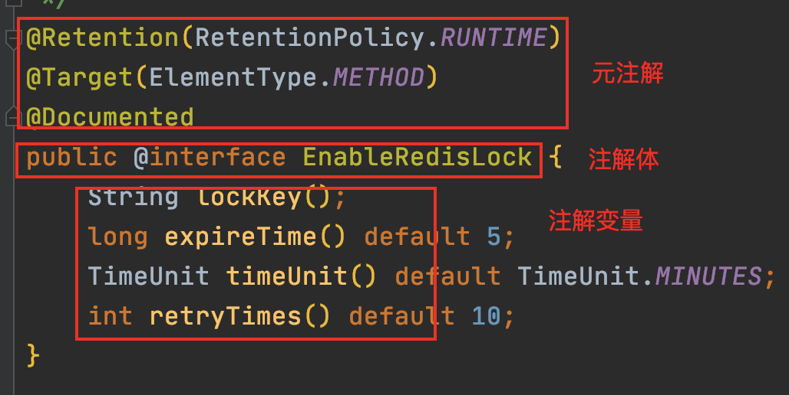

### 项目演示

这个项目是用来测试哪种情况会走注解，哪种不会走

- 核心方法 UserLogic testAop
- 在单测里运行即可

### 参考资料

> https://github.com/liwagu/java-eight-part/blob/master/docs/java/annotation/%E6%83%B3%E8%87%AA%E5%B7%B1%E5%86%99%E6%A1%86%E6%9E%B6%E4%B8%8D%E4%BC%9A%E5%86%99Java%E6%B3%A8%E8%A7%A3%E5%8F%AF%E4%B8%8D%E8%A1%8C.md